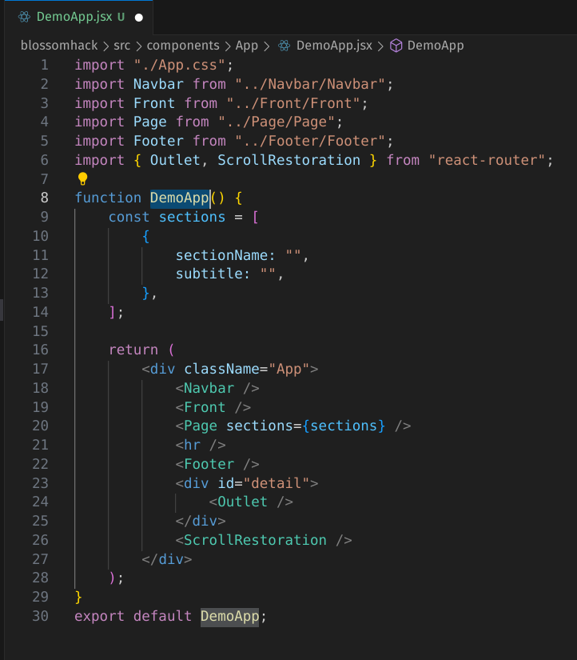
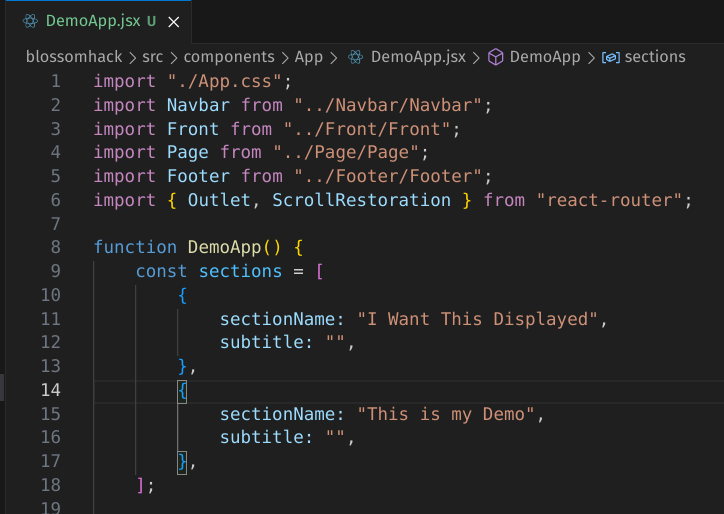

# BlossomHack Website

Welcome to the Github repository for the BlossomHack website!


- [Creating New Section](#creating-new-section)
- [Creating New Page](#creating-new-page)
- [Adding Section to Navbar](#adding-section-to-navbar)
- [Page-Specific Layout](#page-specific-layout)
- [Libraries](#libraries)
- [Special Thanks](#special-thanks)

## Creating New Section

In this example, we will create a new section called "Demo" and demonstrate how it is done.

1. In src/components, create a new folder for your new section labeled "Demo".

   ```
   src/components/Demo
   ```

   

2. Create a file labeled "Demo.jsx" in the folder.

   - Optionally, create a file called "Demo.css" if you would like to style your Demo.jsx. Just make sure to put the following in the first few lines of the Demo.jsx file.

     ```
     import "./Demo.css"
     ```

   

3. Include the following lines in Demo.jsx:

   ```
   export default function Demo() {
       return(
           <div className="Demo" id="Demo">
               Example Text Here. Can remove once you actually start section.
           </div>
       );
   }
   ```

   Create your section and fill it with whatever details you want there.

   Note: If you would like to render different sections depending on the page visited, look [here](#page-specific-layout-for-section) for details.

   

4. After you are finished creating your section, go to src/components/Section/Section.jsx. In the import section up top, do the following:

   ```
   import Demo from "../Demo/Demo"
   ```

   

5. In the same file, go to each page that you would like your section to be rendered in (denoted by "location.pathname" at the beginning) and insert the following code in line with the rest of them:

   ```
   {sectionName === "This is my Demo" && <Demo />}
   ```

   

6. Go to src/components/App. For each page that you put your section in, go to the respective .jsx file and insert the following in the sections variable:

   ```
   {
       sectionName: "This is my Demo",
       subtitle: "",
   },
   ```

   Note: The sectionName here MUST be the same as the sectionName in the previous step, else it will not render.

   

### Results


## Creating New Page

In this example, we will create a new page called "DemoApp" and demonstrate how to navigate to it within our website.

1. Go to src/components/App and create a new file named "DemoApp.jsx".

   

2. Paste the following code into your file:

   ```
   import "./App.css";
   import Navbar from "../Navbar/Navbar";
   import Front from "../Front/Front";
   import Page from "../Page/Page";
   import Footer from "../Footer/Footer";
   import { Outlet, ScrollRestoration } from "react-router";

   function DemoApp() {
     const sections = [
       {
         sectionName: "",
         subtitle: "",
       },
     ];

     return (
       <div className="App">
         <Navbar />
         <Front />
         <Page sections={sections} />
         <hr />
         <Footer />
         <div id="detail">
           <Outlet />
         </div>
         <ScrollRestoration />
       </div>
     );
   }
   export default DemoApp;
   ```

   

3. In the sections array of the code, insert titles for each sections you want to display there as such:

   ```
   {
       sectionName: "I Want This Displayed",
       subtitle: "",
   },
   ```

   

4. Navigate to src/main.jsx and import the following above:

   ```
   import DemoApp from "./components/App/DemoApp";
   ```

   

5. Within the same file, go to the router variable where createHashRouter is used. Create a name for the page (in this case, "mydemopage") and insert the following object in accordance with the rest of the array items there:

   ```
   {
       path: "/mydemopage",
       element: <DemoApp />,
       errorElement: <Error />,
   },
   ```

   

6. Go to src/components/Section/Section.jsx. Import any necessary sections you want to use for your page (if it is not already in the imports).

   

7. In the same file and within the return statement, insert the following code, adding all the sectionName you have made along with the apropriate section for that name:

   ```
   {location.pathname === "/mydemopage" && (
       <div>
           <h2>{sectionName}</h2>
           <h3>{subtitle}</h3>
           {sectionName === "I Want This Displayed" && <Contact />}
           {sectionName === "This is my Demo" && <Demo/>}
       </div>
   )}
   ```

   

### Adding Way to Navigate to New Page

To navigate to your new page, follow the general guideline below.
We will do this in the navbar file for now, but you can put anywhere you feel is appropriate for it (Just make sure it looks nice!).

Note: You can look at Navbar.jsx for an example on navigating between the root and sponsorship pages.

1. In the file you want to put the link to the new page at, import the following:

   ```
   import { Link } from "react-router-dom";

   ```

   

2. Create an HTML with the following basics:

   ```
   <Link to="/mydemopage">Go to my demopage</Link>
   ```

   

### Results


## Adding Section to Navbar

1. Go to the section that you want added to the navbar and copy the id (NOT className) of the upmost div element in the return section

   ```
   return (
       <div className="not this one" id="Demo">
           RANDOM STUFF HERE, IGNORE FOR THIS INSTRUCTION
       </div>
   )
   ```

   

2. Go to src/components/Navbar/Navbar.jsx and scroll down to the return section of the code. For each page you have your section in and want to be displayed in the navbar (denoted by "location.pathname" at the beginning), write the following:

   ```
   <li onClick={() => scrollToSection("Demo")}>Go here to Demo</li>
   ```

   The scrollToSection string will contain the id of the section that you obtained previously. If you do not put the correct id, then it will fail to scroll down to the correct section, if at all.

   

### Results


## Page-Specific Layout for Section

1. In the section you would like to edit, import the following:

   ```
   import { useLocation } from "react-router-dom"
   ```

   

2. Within your default function and before the return line type the following:

   ```
   const location = useLocation();
   ```

   

3. Within the return section of your code, surround each element you want to be displayed in a particular website with the following code:

   ```
   {location.pathname === "/INSERTPAGENAMEHERE" && (

       YOUR PAGE-SPECIFIC DETAILS HERE

   )}

   ```

   Note: If you plan on using the same section with different text for each page, you will need to surround each of those texts with the appropriate page. Take a look at other sections like FAQ.jsx and About.jsx for examples.

   

### Results


## Libraries

- **Vite** - Javascript build tool; Used to set up quick and easy development cycles

- **React-Router-Dom** - React navigation; Used for navigating between different pages on the website

- **ESLint** - Javascript static analyzer and linter; Run "npm run lint" in the command line to find problems and receive coding suggestions

- **Prettier** - Javascript formatter; Used to make formatting easier for users and to set a standard for this project

- **Leaflet and React-Leaflet** - Javascript map library; Used to display a map for users to identify location of hackathon

- **DOMPurify** - Javascript XSS sanitizer; Used to prevent XSS attacks on code when HTML code is rendered from json string in FAQ.jsx

- **Husky** - Javascript commit tool; Used to automate certain commands when developers commit code to Github (ex. running Prettier and auto-format code)

## Special Thanks

Thanks goes to MLH for helping us host our hackathon and providing us the opportunities to start our own student-led hackathon,

The developers behind uOttaHack for a great initial website to start ours from,

Our own developers Nat, Luke, and Justin for developing the initial website before the revamp,

And to challengers and hackers like you, thank you!

- https://mlh.io/
- https://github.com/uOttaHack/uottahack-home
- https://github.com/hi-names-nat
- https://github.com/llukehaskell
- https://github.com/Justin-Garey
